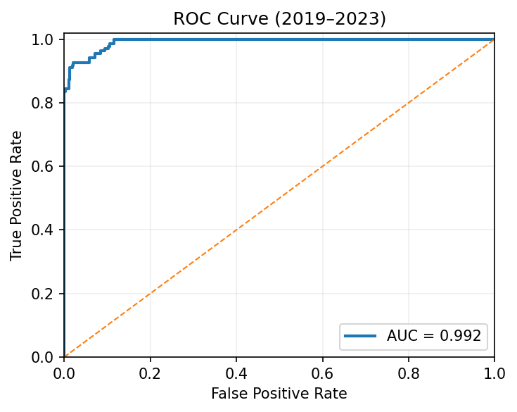
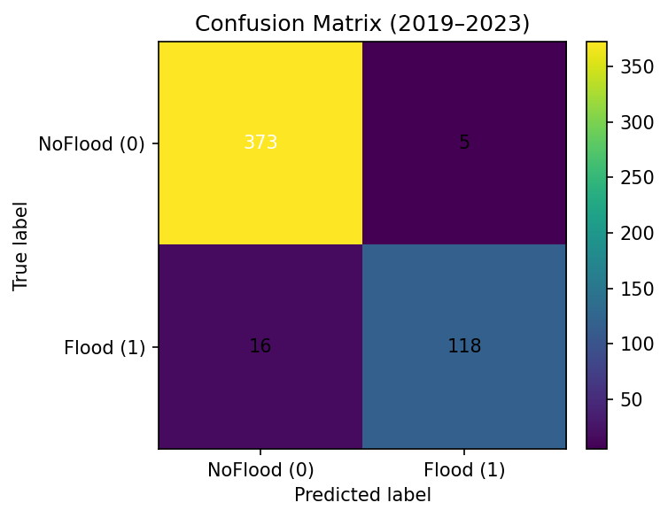
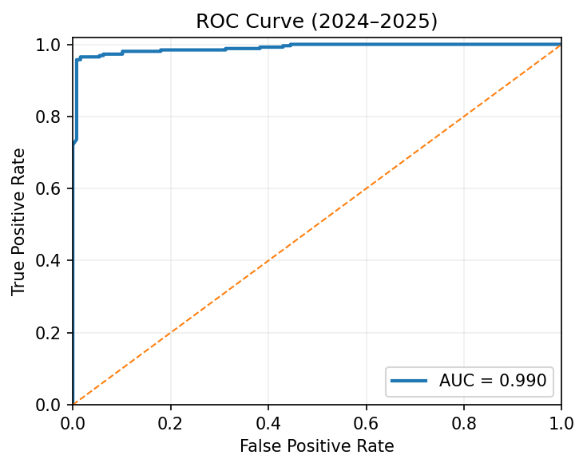
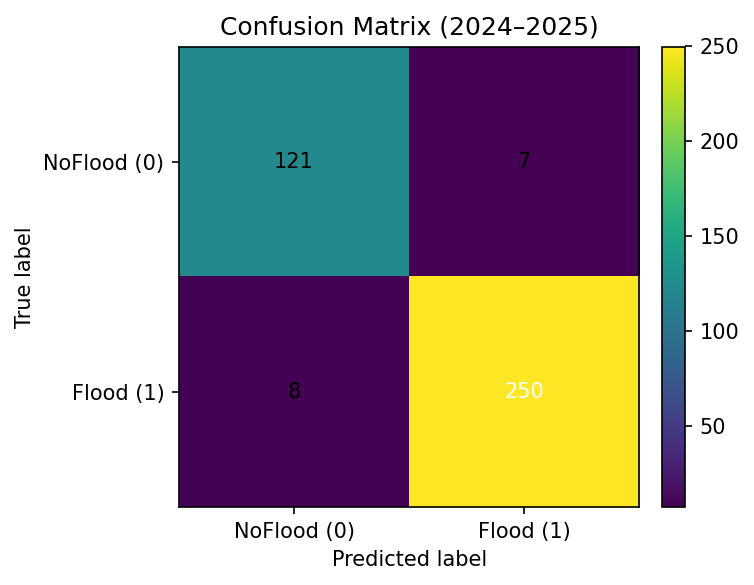

# Temporal Performance Report — Floodzy

**Generated:** 2025-10-21 10:18

**Model:** `xgb_floodzy_national_v2_cuda.json`

---

## Ringkasan Metrik

| Period    |    Rows |   AUC |   Accuracy |   F1_Flood |   F1_NoFlood |   Precision_Flood |   Recall_Flood |
|:----------|--------:|------:|-----------:|-----------:|-------------:|------------------:|---------------:|
| 2019–2023 | 512.000 | 0.992 |      0.959 |      0.918 |        0.973 |             0.959 |          0.881 |
| 2024–2025 | 386.000 | 0.990 |      0.961 |      0.971 |        0.942 |             0.973 |          0.969 |

## 2019–2023

**ROC Curve**  

**Confusion Matrix**  

## 2024–2025

**ROC Curve**  

**Confusion Matrix**  

---

### Catatan

- Evaluasi dilakukan dengan memisahkan data ke dua horizon waktu: 2019–2023 (baseline historis) dan 2024–2025 (out-of-time).
- AUC ≥ 0.95 dan stabil antar-periode menunjukkan robustnes model terhadap perubahan waktu.
- Jika performa periode terbaru turun ≥5%, lakukan retraining dengan data terbaru.
